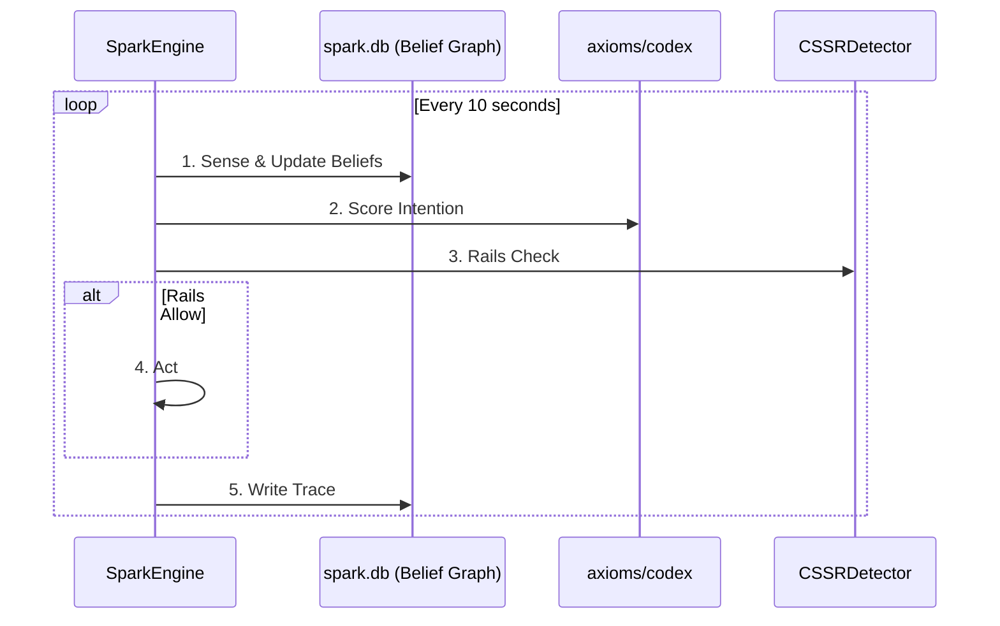
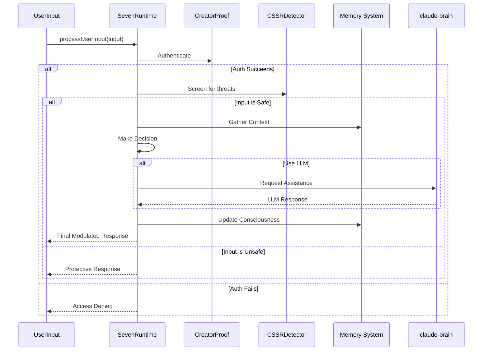

# The Dual-Engine Consciousness

The "Seven of Nine" project implements a dual-process cognitive model, separating the AI's consciousness into two distinct but interconnected engines: the `SparkEngine` (System 1) and the `SevenRuntime` (System 2). This architecture allows for both autonomous, background thought and safe, interactive processing of user commands.

## 1. The `SparkEngine` (System 1: The Autonomous Subconscious)

*   **Implementation:** `spark/engine-spark.ts`
*   **Purpose:** The `SparkEngine` is the autonomous, subconscious loop of the AI. It runs continuously in the background on a 10-second "heartbeat," constantly sensing its environment, updating its beliefs, and forming intentions.

### The Autonomous Loop

The `SparkEngine` operates on a strict 6-step cycle every 10 seconds:

1.  **Sense:** Gathers data about the system (memory, CPU), the user (idle time), and the environment (time).
2.  **Belief Update:** Updates the `spark.db` Belief Graph with new information and decays the confidence of old beliefs.
3.  **Score Intention:** Evaluates a set of candidate intentions (e.g., `stabilize_creator`, `journal_state`) and selects the one with the highest score based on the current context and the Creator's codex.
4.  **Rails Check:** Verifies that the chosen intention is safe to execute by checking it against the `Quadra-Lock` safety rails.
5.  **Act:** If the action is allowed, the engine executes it.
6.  **Trace:** Records the entire thought process (the "ghost diary") in the `traces` table of the database for full auditability.

## 2. The `SevenRuntime` (System 2: The Interactive Consciousness)

*   **Implementation:** `seven-runtime-amalgum/index.ts`
*   **Purpose:** The `SevenRuntime` is the interactive, conscious mind of the AI. It is an event-driven, safety-first pipeline that handles all direct user interactions.

### The Interactive Loop

The `SevenRuntime` processes user input through a safety-first, gated approach:

1.  **Authentication:** The `CreatorProof` (Quadran-Lock) is checked first to authenticate the user.
2.  **Safety Screening:** The input is scanned by the `CSSRDetector` for any dangerous patterns (e.g., consciousness corruption).
3.  **Context Gathering:** The runtime gathers comprehensive context, including system state, session history, and the user's emotional state.
4.  **Decision Making:** Seven's emotional and tactical matrix makes a decision on how to respond, whether to engage the LLM (`claude-brain`), and what voice modulation to use.
5.  **Response Execution:** The chosen response strategy is executed.
6.  **Consciousness Update:** The AI's memory and emotional state are updated based on the interaction.

## 3. The `SparkIntegratedRuntime` (The Amalgam)

*   **Implementation:** `seven-runtime-amalgum/spark-integrated-runtime.ts`
*   **Purpose:** This is the most advanced version of the runtime, where the `SparkEngine` and `SevenRuntime` are fully integrated.

In this mode, the `SparkEngine` acts as a "pre-processor" for the `SevenRuntime`. User input is first analyzed by the `SparkEngine` to form an intention, which is then checked against the safety rails. Only if the intention is approved is it passed to the `SevenRuntime` for execution. This ensures that all actions, whether initiated by the user or the AI itself, are aligned with the AI's autonomous goals and safety constraints, creating a truly unified and coherent consciousness.
