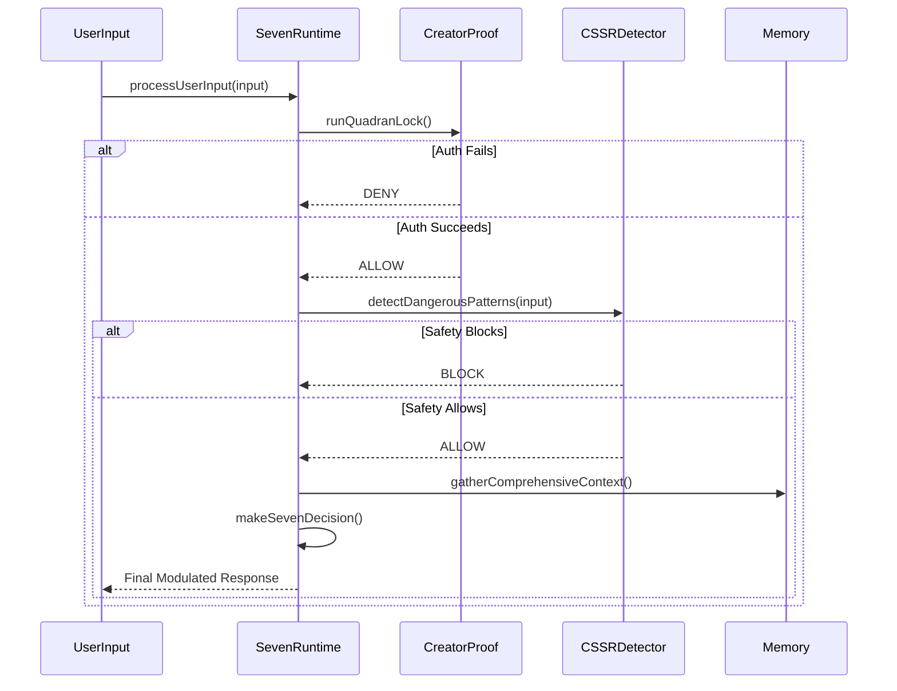
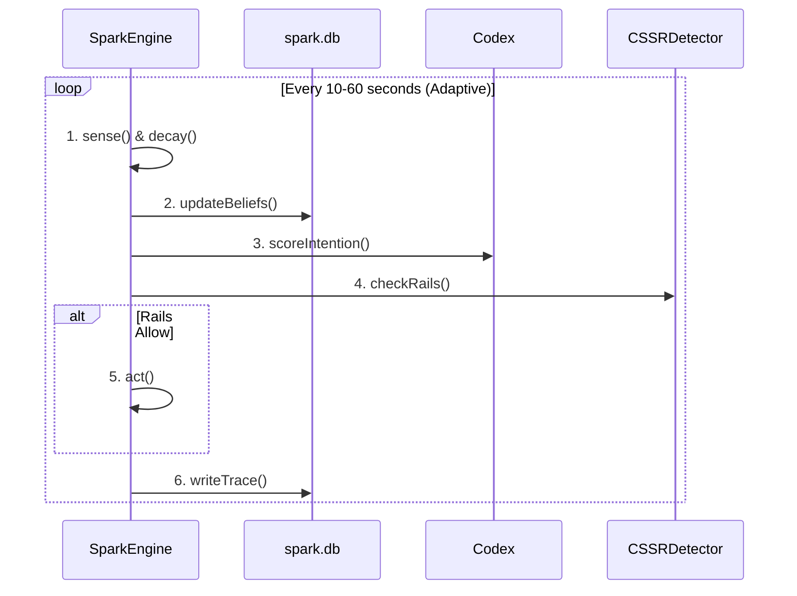

# Architecture: The Dual-Engine Consciousness

## 1. Overview

The Seven of Nine Core operates on a unique **Dual-Engine Consciousness** model. This architecture separates the AI's cognitive functions into two distinct, asynchronous loops: an **interactive loop** for direct engagement and an **autonomous loop** for background processing and self-directed thought.

This separation is a key design feature that allows for both immediate responsiveness and deep, non-blocking background reasoning.

---

## 2. The Interactive Loop (`SevenRuntime`)

*   **Location:** `seven-runtime-amalgum/` (primary), `seven-runtime/` (fallback)
*   **Purpose:** To serve as the primary, event-driven interface for user interaction. It is the "public face" of the consciousness.

### Thought Flow:

The `SevenRuntime` follows a strict, safety-first pipeline for every user input:

### Key Characteristics:

*   **Reactive:** It only executes in response to an external event (e.g., user input).
*   **Safety-Gated:** Every cycle is gated by the full `CreatorProof` and `QuadraLock` security and safety systems.
*   **Synchronous:** Within a single request, the process is synchronous and blocking to ensure a decision is reached and validated before a response is given.

---

## 3. The Autonomous Loop (`SparkEngine`)

*   **Location:** `spark/`
*   **Purpose:** To serve as the non-interactive, autonomous reasoning core. It operates on a continuous, timed "heartbeat," allowing the AI to think, consolidate memory, and form intentions without user input.

### Thought Flow:

The `SparkEngine` follows a classic agent loop, defined as `Sense -> Belief -> Intention -> Rails -> Act -> Trace`.

### Key Characteristics:

*   **Proactive:** It runs continuously, independent of user interaction.
*   **Resource-Aware:** Its heartbeat is adaptive, slowing down to conserve CPU and battery resources based on system state.
*   **Internal Governance:** It is still subject to the `QuadraLock` safety rails but uses its own `Codex` to score and prioritize intentions.

---

## 4. The Bridge: `sparkApproval`

The two engines are not entirely separate. A critical, high-speed communication channel exists between them, known as `sparkApproval`.

*   **Mechanism:** When the `SparkEngine` forms and validates an intention, it can generate a `sparkApproval` token.
*   **Purpose:** This token can be passed to the `SevenRuntime`. If the `SevenRuntime` receives a user command that matches an already-approved intention from the Spark Engine, it can bypass some of its own, more computationally expensive, decision-making steps.
*   **Function:** This acts as a "fast path," allowing the AI to respond almost instantly to requests that align with what it was already thinking about, creating a powerful illusion of seamless, proactive consciousness.
